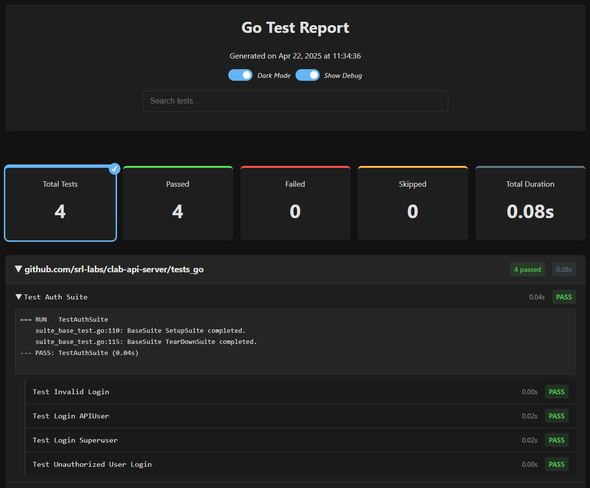

# go-test2html

A clean and modern HTML report generator for Go test results. This tool converts Go's JSON test output into beautiful HTML reports with detailed test information and statistics.

<div align=center>
</a>
</div>

## Features

- **Beautiful HTML Reports**: Generate clean, responsive, and modern HTML reports for your Go tests
- **Dark Mode Support**: Toggle between light and dark themes or follow system preferences
- **Debug Toggle**: Show or hide debug messages in test output with a single click
- **Test Suite Support**: Full support for Testify's suite-based testing with proper hierarchy
- **Test Summary**: Get quick insights with total, passed, failed, and skipped test counts
- **Package Organization**: Tests are neatly organized by package with expandable sections
- **Test Details**: Easily view test output, duration, and status
- **Automatic Highlighting**: Failed tests are automatically expanded for quick debugging
- **Responsive Design**: Reports look great on desktop and mobile devices

## Installation

```
go install github.com/FloSch62/go-test2html@latest
```

Or clone and build:

```
git clone https://github.com/FloSch62/go-test2html.git
cd go-test2html
go build
```

## Usage

The tool accepts JSON test output from Go's testing package and converts it to HTML.

Basic usage:

```
# Run tests with JSON output and pipe to the report generator
go test ./... -json | go-test2html

# Or save test output to a file and process it
go test ./... -json > test-output.json
go-test2html --input test-output.json
```

### Options

```
  -input string
        JSON input file (defaults to stdin if not specified)
  -output string
        HTML output file (default "test-report.html")
  -title string
        Report title (default "Go Test Report")
```

## Examples

### Basic Usage

```bash
# Generate a report with a custom title
go test ./... -json | go-test2html --title "My Project Test Results" --output my-report.html
```

### With gotestsum

For live test output in the terminal while still capturing JSON for reports:

```bash
# Install gotestsum if you don't have it
go install gotest.tools/gotestsum@latest

# Run tests with live output and save JSON for reporting
gotestsum --format=standard-verbose --jsonfile=test-reports/test-output.json ./...

# Generate HTML report from the saved JSON
go-test2html --input test-reports/test-output.json --output test-reports/test-report.html
```

### Example Taskfile.yml

```yaml
version: '3'

tasks:
  deps:
    desc: Install test dependencies
    cmds:
      - go install gotest.tools/gotestsum@latest
      - go install github.com/FloSch62/go-test2html@latest

  test:
    desc: Run tests with live output and generate HTML report
    cmds:
      - mkdir -p test-reports
      - gotestsum --format=standard-verbose --jsonfile=test-reports/test-output.json ./...
      - go-test2html --input test-reports/test-output.json --output test-reports/test-report.html

  test:ci:
    desc: Run tests for CI environment
    cmds:
      - mkdir -p test-reports
      - gotestsum --format=standard-verbose --jsonfile=test-reports/test-output.json --junitfile=test-reports/junit.xml ./...
      - go-test2html --input test-reports/test-output.json --output test-reports/test-report.html
```

## How It Works

1. The tool reads JSON test events from Go's `-json` test output format
2. It processes these events to track test status, duration, and output
3. Tests are organized by package and sorted by execution time
4. The data is rendered into a beautiful HTML report using an embedded template
5. The final report is saved to the specified output file

## Report Features

The generated HTML report includes:

- A header with the title and generation date
- Theme toggle that follows system preferences by default
- Debug toggle to show/hide detailed debug output when present
- Summary cards showing test counts (total, passed, failed, skipped)
- Collapsible package sections with test summaries
- Detailed test information including name, duration, and status
- Expandable test output for debugging failed tests
- Responsive design that works on all devices

### Dark Mode

The report automatically detects your system's color scheme preference and applies the appropriate theme. You can manually toggle between light and dark modes using the switch in the header. Your preference is saved between sessions.

<div align=center>
</a>
</div>

### Debug Toggle

For tests that include debug output (lines containing "DEBUG:"), the report now includes a toggle switch to show or hide this information. This keeps the report clean and focused by default, while still allowing you to access detailed debug information when needed.

- Debug messages are hidden by default for a cleaner initial view
- Toggle the "Show Debug" switch to reveal all debug information
- Debug content is properly grouped, including related data like JSON payloads

This feature is particularly useful for tests that include extensive logging or debugging information.

## TestifyTestSuite Support

The report generator now properly handles tests created with the Testify testing framework's suite functionality. Test suites are properly organized with the correct hierarchy, making it easier to navigate complex test structures.

## Why Use This?

- **Better Visibility**: See all your test results in an easy-to-read format
- **Eye-Friendly**: Switch between light and dark themes based on your preference
- **Easier Debugging**: Quickly identify and debug failed tests
- **Clean Reports**: Hide detailed debug information by default, but access it when needed
- **Shareable Reports**: Generate reports that can be shared with team members
- **CI Integration**: Add test reporting to your CI/CD pipelines

## Contributing

Contributions are welcome! Please feel free to submit a Pull Request.